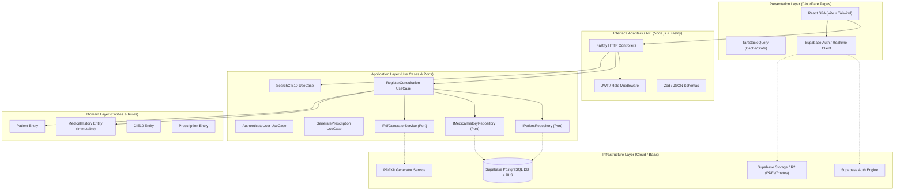
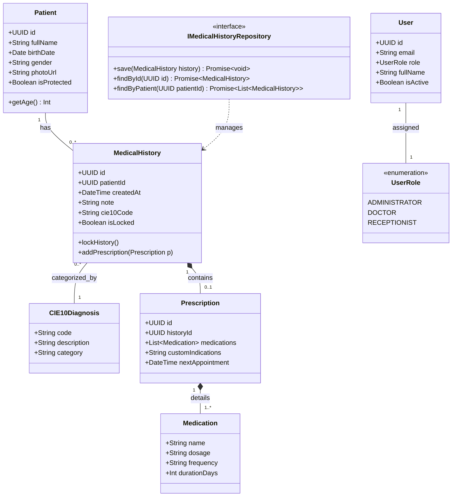
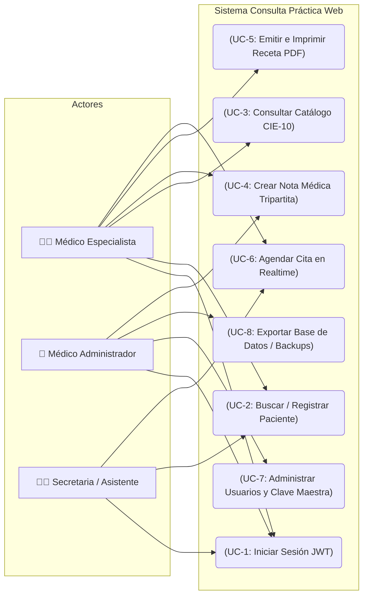
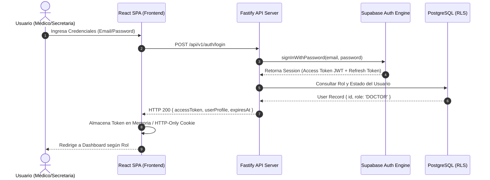
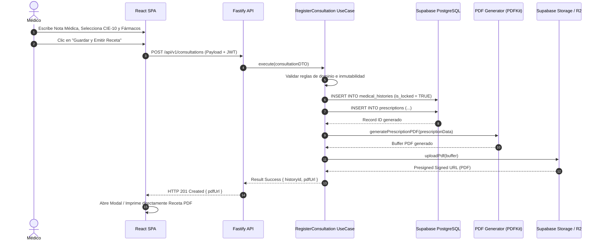
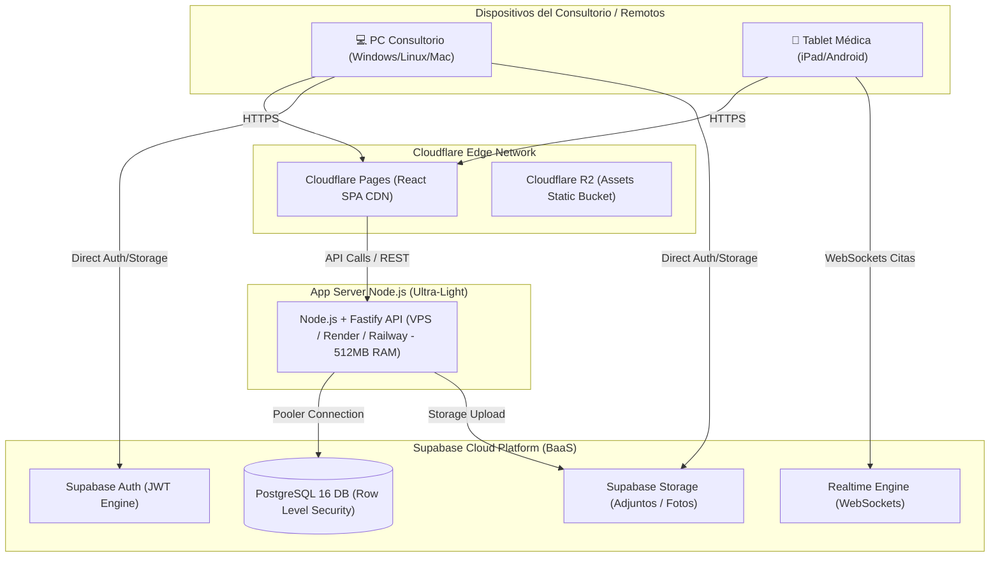
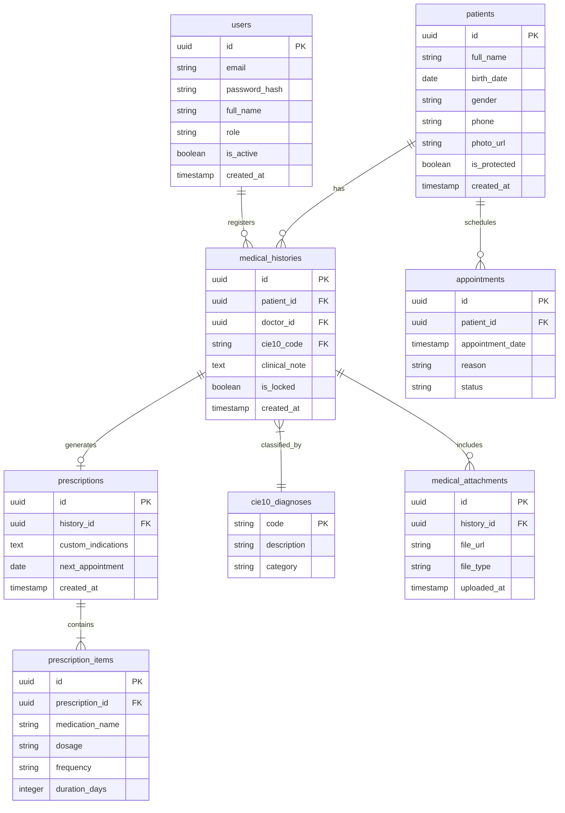

# SSD — Consulta Práctica Web
> **Versión:** 2.0 Web · **Estado:** Documento Técnico Oficial · **Fuente de Verdad:** `index.html` (raíz del repositorio)

---

## 1. Resumen Ejecutivo y Objetivo de la Migración

El sistema legacy **"Consulta Práctica"** ha brindado un servicio efectivo en consultorios médicos para el registro de expedientes, emisión de recetas, agenda de citas y diagnósticos CIE-10. Sin embargo, su arquitectura basada en archivos monolíticos Microsoft Access (`.mdb`), integración COM/OLE con Microsoft Word y ejecución exclusiva sobre escritorio Windows presenta severas limitaciones operativas.

**Objetivo General:** Diseñar y documentar la migración del sistema a una plataforma Web SPA + API REST Serverless/Cloud, aplicando **Clean Architecture** para desacoplar el dominio clínico de la infraestructura tecnológica, maximizando el rendimiento en computadoras de bajos recursos y garantizando alta disponibilidad sin costos elevados.

La transformación integral abarca el paso del software médico legacy (Visual Basic / MS Access) hacia una arquitectura moderna, ultra-ligera y altamente escalable con **Node.js (Fastify)**, **Supabase (PostgreSQL / Auth / Storage / Realtime)** y **Cloudflare Pages & R2**.

---

## 2. Problemática del Sistema Legacy (MS Access / OLE Word)

| Criterio | Sistema Legacy (Desktop / MS Access) | Nueva Arquitectura Web Propuesta |
|---|---|---|
| **Arquitectura General** | Monolito de escritorio (Windows GUI + motor embebido MDB). | SPA en Frontend (Cloudflare Pages) + API REST Backend (Node.js/Fastify) + BaaS (Supabase). |
| **Persistencia de Datos** | Ficheros MS Access `.mdb` (Límite 2 GB, sin MVCC). | PostgreSQL 16 Administrado en Supabase (Transaccional ACID, búsquedas FTS, RLS). |
| **Concurrencia Multi-usuario** | Monopoluesto o LAN básica con bloqueos de tabla pesados. | Concurrencia real ilimitada mediante MVCC y Supabase Realtime para agendas sincronizadas. |
| **Consumo de Recursos (RAM/CPU)** | Ejecución local pesada con dependencias de MS Office OLE. | Backend Fastify ultra-ligero (<35 MB RAM), ejecutable en mini-servidores o VPS económicos. |
| **Autenticación y Permisos** | Contraseña maestra local y claves simples en tablas Access. | Supabase Auth (JWT, tokens con rotación, RBAC estricto y Row Level Security nativo en BD). |
| **Emisión de Recetas y Reportes** | Automatización OLE/COM hacia MS Word (requiere Office instalado). | Generación nativa PDF en backend/cliente mediante PDFKit / templates HTML semánticos. |
| **Almacenamiento de Adjuntos** | Rutas locales fijas en disco duro para imágenes/PDFs. | Bucket privado en Supabase Storage / Cloudflare R2 con URLs pre-firmadas temporales. |
| **Respaldos y Seguridad** | Copia manual a memorias USB. Riesgo de pérdida física. | Backups automatizados continuos (Point-in-Time Recovery) en la nube. Cifrado TLS/AES-256. |

### Limitaciones Específicas del Legacy

- **Riesgo de Corrupción de Datos:** El motor DAO/MS Access carece de control de concurrencia multiusuario real en red local (LAN), produciendo bloqueos de archivos o corrupción en tablas ante caídas de red o cortes de energía.
- **Falta de Movilidad y Accesibilidad:** Inexistencia de soporte para dispositivos móviles, tablets o acceso remoto fuera del consultorio.
- **Dependencia Tecnológica Obsoleta:** Integración OLE rígida con Microsoft Word para reportes e imposibilidad de ejecutar en sistemas no-Windows.
- **Proceso Manual de Respaldos:** Dependencia del usuario para ejecutar copias manuales en memorias USB, vulnerando la continuidad operativa y la seguridad.

---

## 3. Arquitectura Clean Architecture

Para asegurar que el núcleo de la lógica médica permanezca agnóstico a cambios en proveedores cloud o librerías de infraestructura, la aplicación se estructura siguiendo los principios de **Clean Architecture** (Uncle Bob).

### 3.1 Domain Layer (Núcleo de Dominio)

Contiene las entidades puras (`Patient`, `MedicalHistory`, `CIE10Diagnosis`, `Prescription`) y Value Objects (`ICD10Code`, `PatientID`). Implementa la regla crítica de negocio: *Inmutabilidad estricta del historial clínico una vez guardado* (`isLocked = true`).

- **No depende de ninguna capa externa.**
- Contiene únicamente lógica de negocio pura y portable.
- Define las invariantes: un `MedicalHistory` con `isLocked = true` no puede ser modificado.

### 3.2 Application Layer (Casos de Uso)

Orquesta los flujos de la aplicación. Define las interfaces/puertos para repositorios y servicios de infraestructura.

**Casos de Uso:**
- `RegisterConsultation` (aliased como `RegisterClinicalConsultationUseCase`)
- `AuthenticateUser`
- `SearchCIE10` (aliased como `SearchICD10UseCase`)
- `GeneratePrescription` (aliased como `GeneratePrescriptionPdfUseCase`)

**Puertos (Interfaces):**
- `IPatientRepository`
- `IMedicalHistoryRepository`
- `IPdfGeneratorService`

### 3.3 Infrastructure Layer (Implementación)

Implementa los adaptadores técnicos:
- Cliente Supabase SDK (`SupabaseClient.ts`)
- Repositorios de PostgreSQL (`PostgresPatientRepository.ts`)
- Motor de búsquedas de texto completo
- Servicios de almacenamiento en S3/Cloudflare R2 (`SupabaseStorageService.ts`)
- Generador de archivos PDF (`PdfKitService.ts`)

### 3.4 Interface Adapters / API Layer

Transforma los datos de entrada/salida HTTP. Controladores REST ultra-rápidos construidos sobre **Node.js + Fastify**, middlewares de autenticación JWT y validadores de schemas DTO.

- `authMiddleware.ts` — Validación de JWT en cada request autenticado
- `roleGuard.ts` — Control de acceso por rol (RBAC)
- Schemas DTO mediante Zod / JSON Schema

---

## 4. Diagramas UML (reproducir los 7 bloques Mermaid)

### 4.1 Componentes — Arquitectura en Capas



**Descripción Técnica:** Muestra la estricta orientación de dependencias hacia el centro (Dominio). La interfaz web SPA en Cloudflare interactúa con el backend Fastify para la lógica de negocio y directamente con Supabase para Auth/Storage/Realtime mediante Row Level Security (RLS).

---

### 4.2 Clases — Modelo de Dominio



**Descripción Técnica:** Representa el modelo orientado a objetos del dominio clínico. Se destaca la composición entre `MedicalHistory` y `Prescription`, así como la invariante `lockHistory()` que congela la edición del expediente.

---

### 4.3 Casos de Uso



**Descripción Técnica:** Identifica el control de acceso por roles (RBAC). El personal de secretaría puede gestionar pacientes y citas sin acceso a las notas clínicas confidenciales, salvaguardando la privacidad.

---

### 4.4 Secuencia — Autenticación JWT



**Descripción Técnica:** Describe el flujo de inicio de sesión multinivel con validación de tokens de corta duración y asignación de claims de rol para la seguridad en endpoints backend y en la base de datos Supabase.

---

### 4.5 Secuencia — Consulta Médica & Receta PDF



**Descripción Técnica:** Demuestra el proceso de consulta clínica completa. Al guardar, el historial médico pasa automáticamente al estado inmutable (bloqueado para edición) y se genera una receta en PDF lista para ser enviada a la impresora o compartida.

---

### 4.6 Despliegue — Cloudflare / Fastify / Supabase



**Descripción Técnica:** Muestra la topología de despliegue. El frontend estático corre distribuido en el CDN de Cloudflare Pages, la API Node.js/Fastify se ejecuta en un micro-servidor de ultra-bajo consumo y Supabase gestiona la persistencia en la nube.

---

### 4.7 Diagrama Entidad-Relación



**Descripción Técnica:** Esquema relacional optimizado para PostgreSQL. Normaliza la información de prescripciones, adjuntos y catálogos, resolviendo los defectos de integridad y limitación de espacio de las tablas planas legacy de MS Access.

---

## 5. Modelo de Datos y Estrategia ETL (Extract/Transform/Load desde .mdb)

Para migrar la información existente desde los archivos `.mdb` de MS Access hacia el nuevo esquema relacional en PostgreSQL (Supabase), se implementará una herramienta ETL automatizada en Python o Node.js.

### Fases del Pipeline ETL

1. **Extracción (Extract):** Conexión al archivo `.mdb` legacy utilizando controladores ODBC (`pyodbc` o `node-adodb`) para leer las tablas de Pacientes, Historias, Fármacos y Citas.

2. **Transformación & Saneamiento (Transform):**
   - Conversión de codificación de texto de `Windows-1252` a `UTF-8` nativo.
   - Transformación de identificadores de clave enteros correlativos o cadenas a UUID v4 universales.
   - Parseo y validación de formatos de fechas erróneas o nulas.
   - Normalización del texto del lemario médico y correspondencia de diagnósticos con el código CIE-10 estándar.

3. **Carga (Load):** Inserción por lotes (batch loading) utilizando transacciones SQL en PostgreSQL a través del cliente Supabase, respetando las restricciones de clave foránea.

### Mapeo Tabla Legacy → Tabla Destino

| Tabla Legacy MS Access | Tabla Destino PostgreSQL | Transformaciones Clave |
|---|---|---|
| `tblPacientes` | `patients` | ID entero → UUID v4, codificación Windows-1252 → UTF-8 |
| `tblHistorias` / `tblConsultas` | `medical_histories` | `is_locked = TRUE` en todos, ID → UUID v4 |
| `tblFarmacos` / `tblRecetas` | `prescriptions` + `prescription_items` | Normalización a registros separados por ítem |
| `tblCitas` | `appointments` | Fechas nulas → NULL, formatos DD/MM/YYYY → ISO 8601 |
| `tblDiagnosticos` (texto libre) | `cie10_diagnoses` (FK) | Mapeo/correspondencia al catálogo CIE-10 estándar |

---

## 6. Estructura de Carpetas del Proyecto

```plaintext
consulta-practica-web/
├── backend/                                 # API Node.js + Fastify (Clean Architecture)
│   ├── src/
│   │   ├── domain/                          # CAPA DE DOMINIO (Entidades puras y Reglas)
│   │   │   ├── entities/                    # Patient.ts, MedicalHistory.ts, Prescription.ts
│   │   │   ├── value-objects/               # ICD10Code.ts, PasscodeHash.ts
│   │   │   ├── exceptions/                  # DomainException.ts
│   │   │   └── ports/                       # Interfaces (IPatientRepository.ts, IPdfService.ts)
│   │   ├── application/                     # CAPA DE APLICACIÓN (Casos de Uso)
│   │   │   ├── use-cases/                   # RegisterConsultation.ts, AuthenticateUser.ts
│   │   │   └── dtos/                        # ConsultationDTO.ts, PatientDTO.ts
│   │   ├── infrastructure/                  # CAPA DE INFRAESTRUCTURA (Técnica)
│   │   │   ├── supabase/                    # SupabaseClient.ts, PostgresPatientRepository.ts
│   │   │   ├── pdf/                         # PdfKitService.ts (Generador de recetas)
│   │   │   └── storage/                     # SupabaseStorageService.ts
│   │   ├── interfaces/                      # ADAPTADORES HTTP / API (Fastify)
│   │   │   ├── routes/                      # patientRoutes.ts, consultationRoutes.ts
│   │   │   ├── middlewares/                 # authMiddleware.ts, roleGuard.ts
│   │   │   └── etl/                         # mdb_migrator.py (Script de migración legacy)
│   │   └── server.ts                        # Entry point Fastify (Bajo consumo RAM)
│   ├── package.json
│   └── tsconfig.json
│
├── frontend/                                # CLIENTE WEB SPA (Cloudflare Pages)
│   ├── src/
│   │   ├── assets/                          # Estilos CSS, Tailwind Setup
│   │   ├── components/                      # Componentes UI Reutilizables
│   │   │   ├── ui/                          # Button.tsx, Dialog.tsx, Input.tsx (Shadcn)
│   │   │   └── layout/                      # Sidebar.tsx, Topbar.tsx
│   │   ├── features/                        # Módulos Funcionales
│   │   │   ├── auth/                        # Componentes de Login y Contexto de Sesión
│   │   │   ├── patients/                    # Expediente alfabético, Galería clínica
│   │   │   ├── consultation/                # Formulario tripartito y buscador CIE-10
│   │   │   ├── prescriptions/               # Emisión e impresión de Receta PDF
│   │   │   └── appointments/                # Agenda interactiva (Realtime)
│   │   ├── lib/                             # supabaseClient.ts (SDK Supabase JS)
│   │   ├── App.tsx
│   │   └── main.tsx
│   ├── package.json
│   └── vite.config.ts
│
└── index.html                               # Entregable: Documentación técnica interactiva
```

---

## 7. Stack Tecnológico y Justificación

| Capa | Tecnología | Versión / Justificación |
|---|---|---|
| **Backend API** | Node.js + Fastify | Tiempos de respuesta < 10ms, < 35 MB RAM, ideal para VPS modestos |
| **Lenguaje Backend** | TypeScript | `strict: true`, tipado fuerte en entidades de dominio y DTOs |
| **Base de Datos / BaaS** | Supabase (PostgreSQL 16) | Administrado, ACID, FTS, RLS nativo, Auth JWT, Realtime WebSockets |
| **Autenticación** | Supabase Auth (JWT) | Tokens de corta duración con rotación, RBAC, claims de rol |
| **Frontend SPA** | React 18 + Vite + Tailwind CSS | Interfaz fluida, ultra-rápida, optimizada para teclado y tablets |
| **State Management** | TanStack Query | Cache inteligente, sincronización server-state, invalidaciones |
| **SDK Client** | Supabase JS SDK | Auth/Storage/Realtime directo desde el frontend con RLS |
| **Edge CDN** | Cloudflare Pages | Distribución global del SPA estático, latencia casi nula |
| **Object Storage** | Cloudflare R2 / Supabase Storage | Sin costos de egress (R2), URLs pre-firmadas para adjuntos clínicos |
| **Generación PDF** | PDFKit | Generación nativa de recetas en backend, sin dependencia de Word/Office |
| **Validación** | Zod / JSON Schema | DTOs validados en el borde de la API antes de tocar el dominio |
| **ETL Legacy** | Python (`pyodbc`) / Node.js (`node-adodb`) | Conexión ODBC al `.mdb`, transformación y carga en lotes |

---

## 8. Plan de Migración por Fases (Fase 1 a Fase 6, Zero Downtime)

Para asegurar que el consultorio no interrumpa su atención médica diaria, se propone un esquema de migración progresivo sin tiempo de inactividad (Zero Downtime):

### Fase 1 — Dominio & Setup de Infraestructura Cloud
Configuración del proyecto Supabase, tablas en PostgreSQL, buckets en Storage y definición de tipos de datos en Node.js/Fastify.

### Fase 2 — Backend API & Motor PDF
Desarrollo de casos de uso del dominio, endpoints Fastify, lógica de inmutabilidad y servicio de generación de recetas en PDF en reemplazo de OLE Word.

### Fase 3 — Script ETL & Migración de Datos de Prueba
Ejecución del pipeline de extracción desde el archivo `.mdb` legacy a una instancia de staging para validar la integridad de expedientes pasados.

### Fase 4 — Frontend SPA & Módulos Clave
Construcción de la interfaz gráfica en React: expedientes, nota médica tripartita, buscador de diagnósticos CIE-10 y visor de PDFs.

### Fase 5 — Operación en Paralelo & Pruebas en Vivo
Uso simultáneo del sistema legacy y el nuevo sistema web durante 1-2 semanas para verificar usabilidad, rendimiento y consistencia de datos.

### Fase 6 — Despliegue Definitivo & Cierre Legacy
Migración delta final de los datos del día, conmutación oficial a la versión web en Cloudflare Pages y almacenamiento seguro en frío de la BD Access histórica.

---

## 9. Seguridad y Cumplimiento (RLS, inmutabilidad de historiales, cifrado, auditoría)

- **Row Level Security (RLS) en Supabase:** Garantiza a nivel de motor de base de datos que una secretaria solo pueda leer y escribir datos demográficos/citas, imposibilitando la lectura directa de notas clínicas o historiales médicos confidenciales.

- **Protección de Datos e Inmutabilidad:** Los registros de historiales médicos se marcan como `is_locked = TRUE` al guardarse, impidiendo la alteración posterior de notas para cumplir con regulaciones de fiabilidad legal médica.

- **Cifrado en Tránsito y Reposo:** Comunicaciones obligatorias bajo HTTPS / TLS 1.3 y almacenamiento cifrado bajo estándar AES-256 en Supabase PostgreSQL y Storage.

- **Auditoría de Acceso:** Registro de logs de auditoría para cada consulta o descarga de expediente clínico de paciente.

### Matriz de Permisos por Rol

| Recurso | ADMINISTRATOR | DOCTOR | RECEPTIONIST |
|---|---|---|---|
| `clinical_note` (medical_histories) | ✅ Leer/Escribir | ✅ Leer/Escribir | ❌ Sin acceso |
| `prescriptions` | ✅ Leer/Escribir | ✅ Leer/Escribir | ❌ Sin acceso |
| `patients` (datos demográficos) | ✅ Leer/Escribir | ✅ Leer/Escribir | ✅ Leer/Escribir |
| `appointments` | ✅ Leer/Escribir | ✅ Leer/Escribir | ✅ Leer/Escribir |
| `users` (administración) | ✅ Leer/Escribir | ❌ Sin acceso | ❌ Sin acceso |
| Exportar BD / Backups (UC-8) | ✅ | ❌ | ❌ |

---

## 10. Conclusiones y Próximos Pasos

La arquitectura propuesta resuelve integralmente los problemas de obsolescencia, fragilidad de datos y falta de movilidad del sistema **Consulta Práctica** legacy. La combinación de **Node.js (Fastify)** con **Supabase** y **Cloudflare** brinda una plataforma moderna, sumamente económica, mantenible y capaz de funcionar con fluidez impecable en computadoras de bajos recursos.

### Siguientes Pasos Recomendados

1. Crear el proyecto en Supabase y desplegar el esquema SQL inicial en PostgreSQL.
2. Ejecutar el script de prueba ETL sobre un archivo `.mdb` real para validar datos históricos.
3. Iniciar el desarrollo del backend ligero en Node.js/Fastify con la plantilla de recetas PDFKit.

---

*Este documento es generado a partir de `index.html` (fuente de verdad del repositorio). Ante cualquier discrepancia, prevalece el contenido de `index.html`.*
